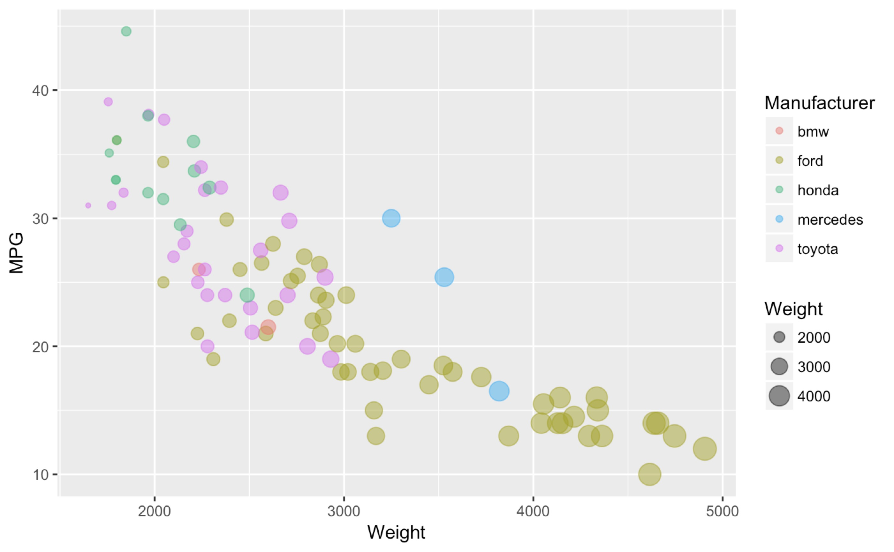
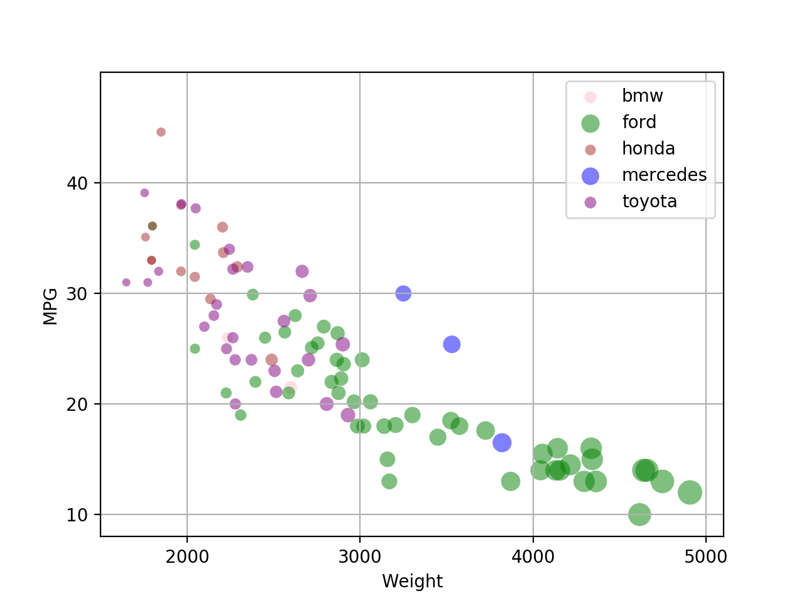
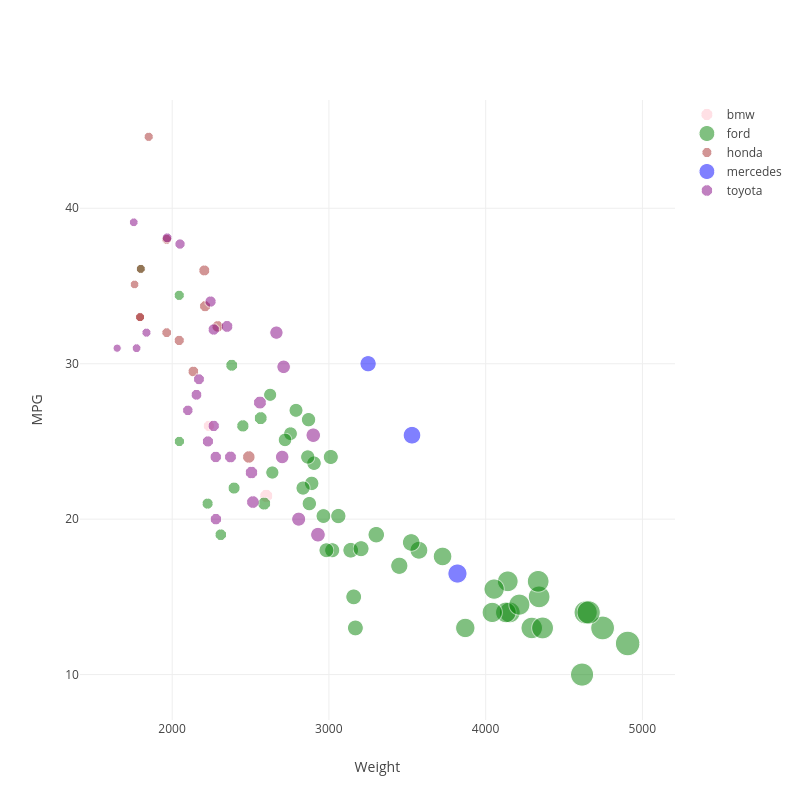
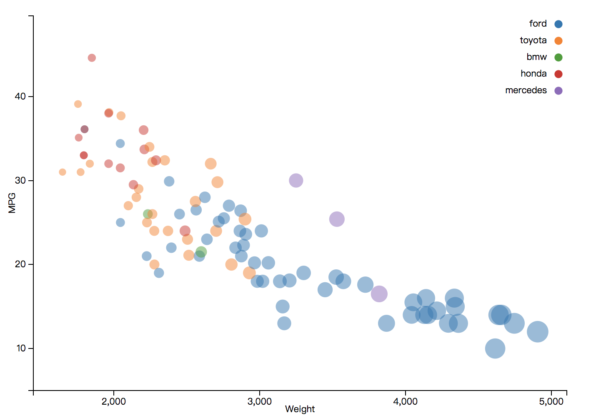
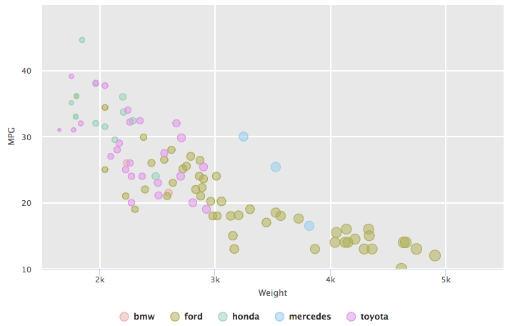
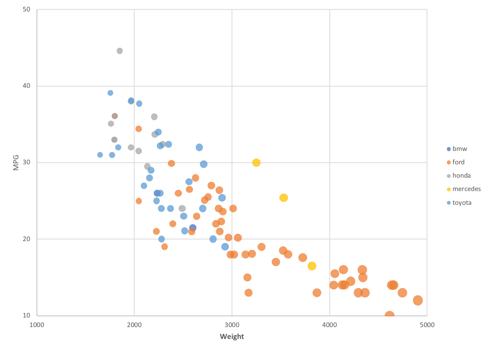
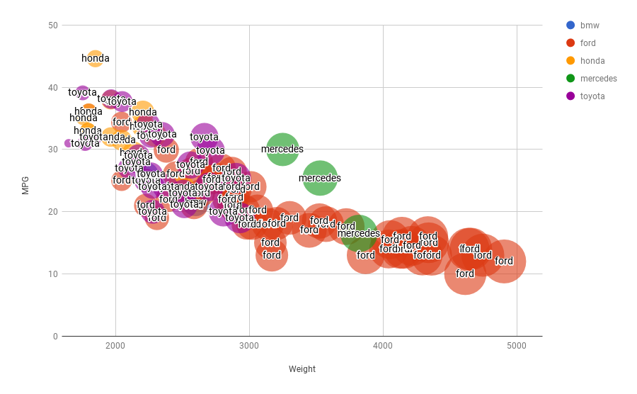
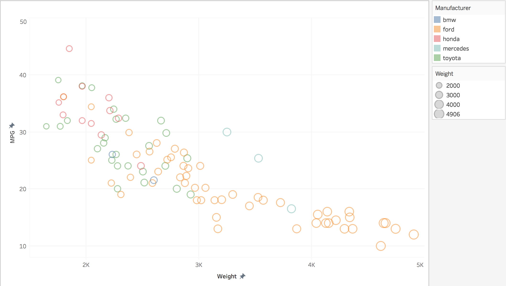
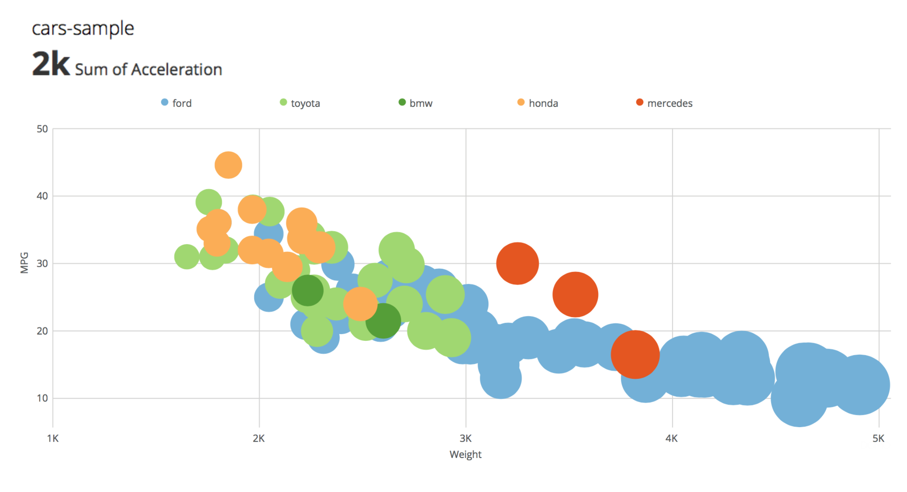
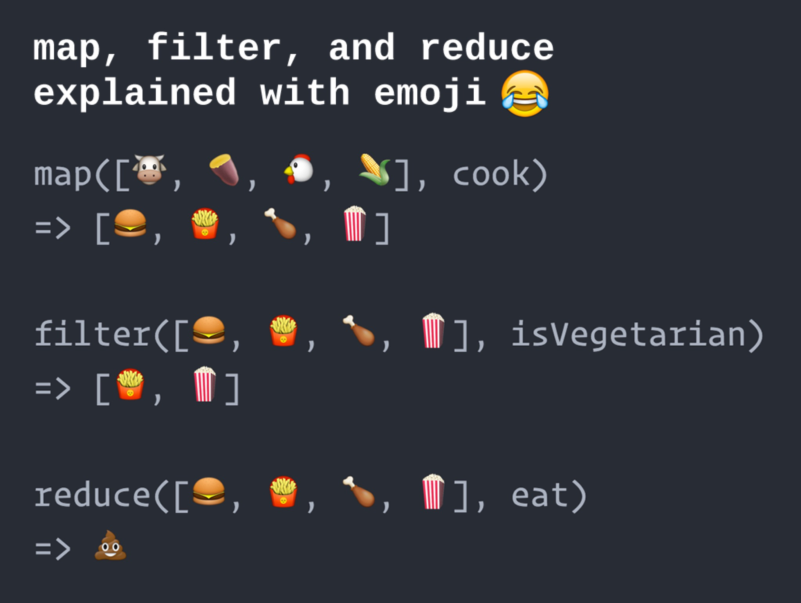

# Overview
- R + ggplot2
- Python + Matplotlib
- Python + Plotly
- Javascript + d3
- Javascript + HighCharts
- Excel
- Google Sheet
- Tableau
- Domo
- Echarts

# R + ggplot2
This is the most efficient tool to get the required chart. With the strong package ggplot2, only few codes can 
get the chart.


**Links**: http://ggplot2.tidyverse.org/reference/qplot.html

# Python + Matplotlib
Matplot has a built-in function to create scatterplots called scatter(). Data can be classified in several groups.
So I divide the data into five different series via manufacturer to get the label in legend. But I have the trouble
why the bubble size in legend is different and still cannot solve it.


# Python + Plotly
This tool is similar with Matplotlib, we load the data and divide it into five categories and use `go.Scatter` to
separate the circles to five different colors.  
But before we use Plot.ly, we need register for a account and get our own KEY for verify the user status. It's inconvenient
for us to use that.


**Links**: https://plot.ly/python/line-and-scatter/  
https://images.plot.ly/plotly-documentation/images/python_cheat_sheet.pdf

# Javascript + d3
Finding a simple tutorial/example of a scatter plot in d3.js proved to be less than trivial. The steps are below:  
- Add the graph canvas and the tooltip area to the webpage.
- Make a circle for each data point and specifying the attributes of items.
- Access data values and filter the useless data.


**Links**: http://bl.ocks.org/weiglemc/6185069  
https://stackoverflow.com/questions/12922236/removing-rows-when-reading-data-d3

# Javascript + HighCharts
HighCharts is fast and reliable, but tha process of adding data points is slow. And the mere amount of objects also
slow down all interaction with the chart, such as the responsiveness of the tooltip while hovering. Besides, the data module didn't provide the functions to parse the CSV data. We need use the jQuery.get method or any
other async loading method to load the data. Without the parsing function, it's totally unfriendly.  
So I use jQuery.ajax() and write the codes for the process of parsing through
two ways.
- Traditional method to load the data and use the same index of three array to build the relationship.
- Magic data reaction chain implemented on modern JavaScript with map-reduce.


**Links**: https://api.hcharts.cn/highcharts#series<scatter>  
https://www.highcharts.com/docs/working-with-data/data-module

# Excel
To create a scatter chart of this information, we need select the worksheet range for five times to create five different
series, and change the attributes needed with easy use and tune interface.



# Google Sheet
It's more easier to use Google Sheet for this chart than Excel, because we can easily add different series just select
the data we use for the index instead of select the whole data. And the functions maybe less than Excel, but less is more! 
It save me a lot of time to find the right button.


# Tableau
In Tableau, we can create a scatter plot by placing at least one measure on the `Columns` shelf and at least one measure on the `Rows` shelf. 
- Drag the MPG measure to Columns.
- Drag the Weight measure to Rows.
- Drag the Manufacturer measure to Color on the Marks card.


# Domo
To make this viz, as other online tool, I need upload the CSV to generate the dataset inside the tool, then choose the axis and set the attributes. 

**Links**: https://www.domo.com/product

# Echarts
ECharts is not a famous javascript package, it was created by Chinese company Baidu. And I use the online tool to vis my data.
it's not difficult but with the non-perfect UX because many functions but seems like useless, I need to spend lots of time
to find the right one.


**Links**: http://tushuo.baidu.com/p.php?p=dta8w274wboslwc4k

# Design Achievements
I have already try my best to imitate the chart as the professor shows, dealing with the color, bubble size and the legend. But some of
them only have one attribute for legend, maybe I still need work on it in the future.

# Technical Achievements
Magic data reaction chain implemented on modern JavaScript with map-reduce. 

Array or vector data processing is a complex procedure which requires many transformation functions or calculations, the JavaScript, however, supports a modern way called map-reduce which had been used in big data field for a long time. Thanks to this feature and the flexible JavaScript grammar, the code we used for data preprocessing in visualization procedure could be magical. 

JavaScript introduced three functions of `Array.prototype`: `map`, `filter`, `reduce`. They receive closure function to transform all data in array, then return tranformed array. This procedure enables us to build **continuity function call** to cover every setp of data process which looks like a reaction chain. Here is my code:

```javascript
// Modern JavaScript Data Process
const chartData = data
 .replace(/NA/g, 0) // Replace NA
 .split('\n')
 .map(line => line.split(','))
 .filter(line => line.length === 11)
 .map(line => line.map(col => JSON.parse(col)))
 .filter(item => manufacturer.indexOf(item[2]) > -1)
 .reduce((result, item) => {
   let index = manufacturer.indexOf(item[2])
   let value = [[item[7], item[3], item[7]]]
   result[index] = result[index].concat(value)
   return result
 }, [[], [], [], [], []])
 .map((item, index) => {
   return {
     name: manufacturer[index],
     data: item,
     color: colors[index]
   }
 })
```

This code, actually, is one line after removing all line breakers and space. May be this is a little bit longer but doesn't it sounds like a spell? To those naughty data, from now on, we are all magicians.

> ***Animagi*** — The transformation spell in *Harry Potter*zation

This code, actually, is one line after removing all line breakers and space. May be this is a little bit longer but doesn't it sounds like a spell? To those naughty data, from now on, we are all magicians.

> ***Animagi*** — The transformation spell in *Harry Potter*



