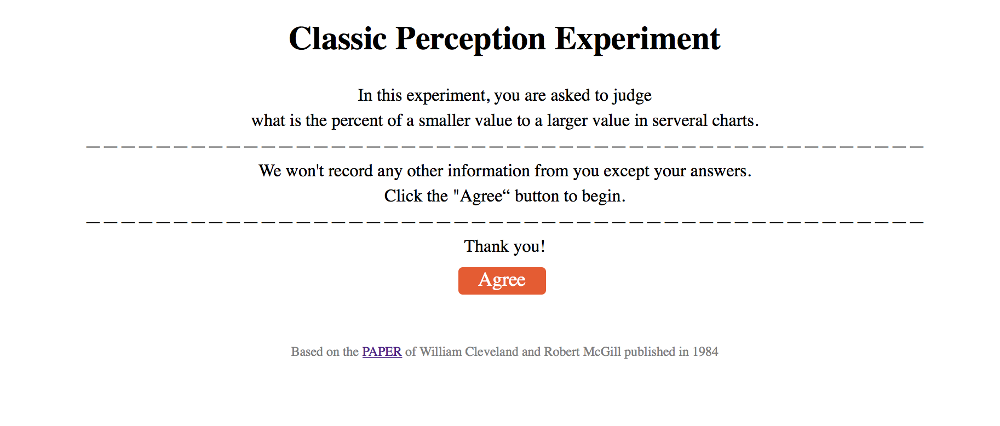
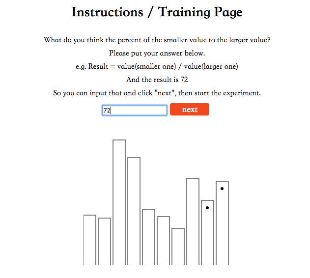
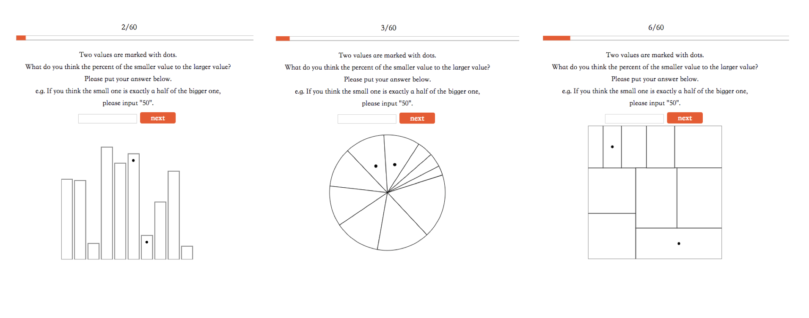
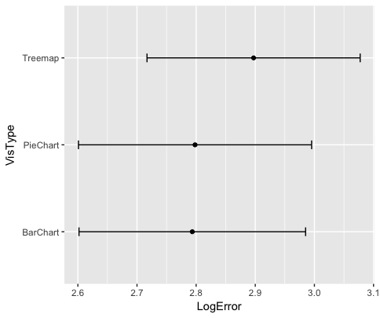

# Overview
## Goals
Replicating controlled experiments by William Cleveland and Robert McGill in 1984

- Test 20 of each three competing visualizations.
- Implement data generation and error calculation functions from Cleveland and McGill's paper;
- Run the experiment with more than 10 participants.
- Do some basic analysis and reporting of the results.

## Introduction
- Front-end	Development: HTML + D3.js + jQuery
- Data Processing: Python / R
- Repository link: [https://sabrina-jiang.github.io/03-Experiment/index.html](https://sabrina-jiang.github.io/03-Experiment/index.html)  

# Example Images
## Index Page
 
## Instructions Page

## Experiment Pages

# Result 
## Log Error

From this figure, we can find BarChart have the best performance and TreeMap have the worst.
The Log Error can reduce more gap between different charts and also some other bias. And the dataset have already replace the value of log error -3 to 0.  
And I use Python to calculate the log error with DataFrame.
## 95% Bootstrap Confidence Interval 
  
Compared with the result with the Cleveland & McGill's experiment, the confidence interval of my experiment is wider, because of less dataset.

# Technical Achievement
- Generate 20 trials per visualization type and use function `shuffle()` to load one of 60 trials randomly.
- Complement the `interval progress bar` in the experiment process to give the hint of process for participant. 
- `Dynamic load` content with jQuery, which allows to dynamically load external resources into an container without leaving or refreshing the current page. 
Because I divide my code into different file included the index page and three generate charts page, I need to redirect pages based on the randomly trial index.

# Design Achievement
- Adding the instruction page before the experiment started, because of using an example can better support explanation of experiment than text.
- Change the font and color of the whole pages to optimize user experience. For example, the color of button is red can express energetic. 
- Of course, the interval progress bar during experiment also improve the user experience.

# Links
- Pie chart: https://bl.ocks.org/mbostock/3887235
- Bar chart: http://bl.ocks.org/d3noob/8952219 
- Interval progress bar: http://bl.ocks.org/keithcollins/a0564c578b9328fcdcbb