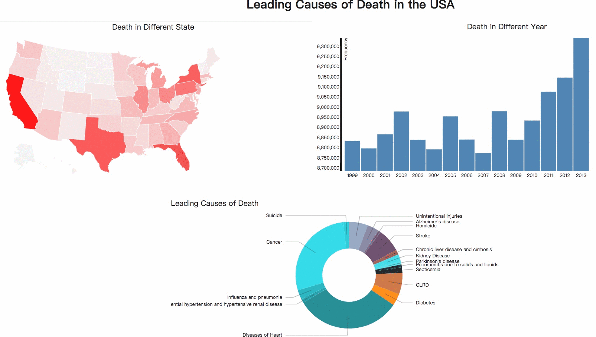

# Overview
Data: https://www.kaggle.com/kingburrito666/leading-causes-of-death-usa/kernels  
Github pages: https://sabrina-jiang.github.io/04-MapsAndViews/  

Every year the CDC releases the country’s most detailed report on death in the United States under the National Vital Statistics Systems. 
This mortality dataset is a record of every death in the USA for 1900 through 2013, and by state of residence for selected year and cause of death.
- Map represents the death in each state
- Barchart represents the death in each year(1900-2013)
- Donut represents the death by each causes  

# Technical Achievement
- Created the model to implement whole process.   
*Service will be initialed by external call.   
*In initialization process, base chart will be built.  
*And data injection process will be executed repeatedly during service lifecycle.  
*Communications between services relay on IPC.  
*Do IPCMain.call will send messages to IPC main.

- The project separate the data unit and program unit to reduce coupling.

# Design Achievement
- Highlight the parts when user select part of charts. It makes them more easier to make sure the selection. For example, the rect of barchart
will change from blue into red.
- Use tooltip to give the concise info for each parts of charts on mouseover to figure out the value of data. 
- Animation with transition, the loading process will smoothly and evenly when multi-view works.